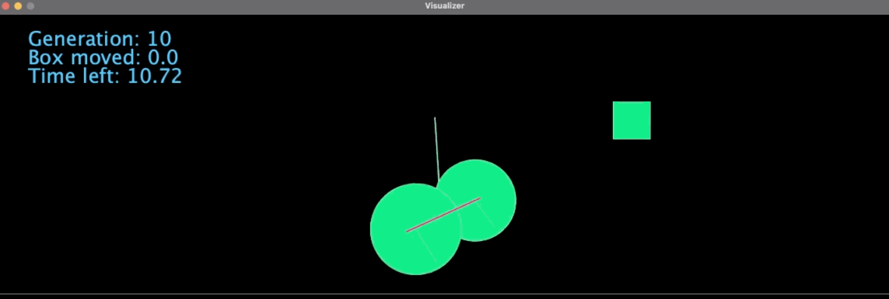
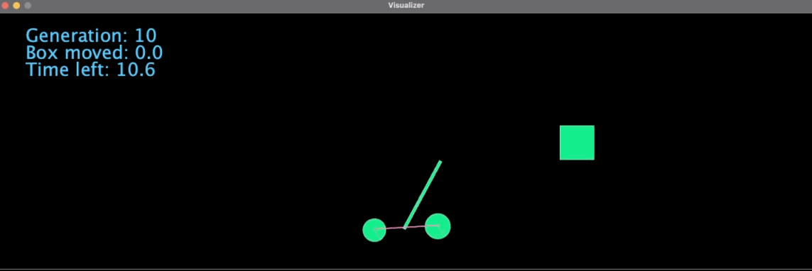

The most interesting English class project I've worked on: evolving creatures in a 2D simulation to move a box.
Traits are encoded in a genome in .txt format and mutated each generation to specify different body part geometry and the weights and biases of links between neurons. Neurons can be activated by body parts contacting various things and neuron activations control the movement of body parts.

Some decided to grow big wheels to travel faster:

One lineage even found a way to throw the box using a simulation glitch:

